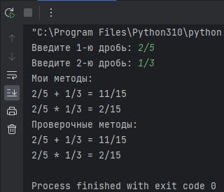
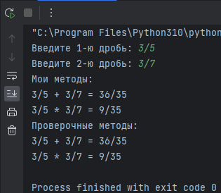

# Погружение в Python. Простые типы данных

## Задача 1
Напишите программу, которая получает целое число и возвращает его шестнадцатеричное
строковое представление. Функцию hex используйте для проверки своего результата.

В ходе работы пользователю необходимо ввести несколько целых чисел. 
Ввод осуществляется до ввода отрицательного значения. 
На основе введенных чисел формируется список, значения из которого 
в последствии конвертируются из 10-й в 16-ю систему счисления. 

**Пример выполнения**

## Задача 2
Напишите программу, которая принимает две строки вида “a/b” - дробь 
с числителем и знаменателем. Программа должна возвращать сумму и
произведение дробей. Для проверки своего кода используйте модуль fractions.

P.S. выделение целой части после операции не производим (проблема отображения 
в консоли). 

**Пример выполнения**

