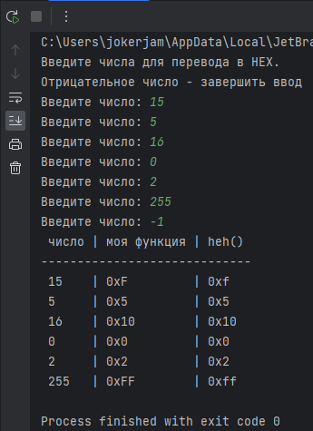
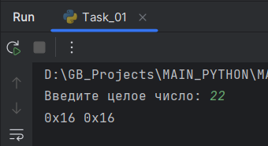

# Погружение в Python. Простыее типы данных

## Задача 1
Напишите программу, которая получает целое число и возвращает его шестнадцатеричное строковое представление. Функцию hex используйте для проверки своего результата.

**пример выполнения****

## Задача 2
Напишите программу, которая принимает две строки вида “a/b” - дробь с числителем и знаменателем. Программа должна возвращать сумму и произведение* дробей. Для проверки своего кода используйте модуль fractions.
